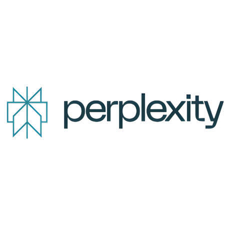

<h1 class="hero-title typing">

👤 About Me

</h1>

Passionate AI & Machine Learning Student • Open Source Contributor • Automation Enthusiast

---

<h2>👋 Hello!</h2>

I'm <b>Hemawarshini Mahendran</b>, a passionate <b>Third Year B.E. Artificial Intelligence & Machine Learning</b> student from <b>K.S. Rangasamy College of Technology</b>.

I enjoy exploring Artificial Intelligence, Workflow Automation, Cloud Technologies and Open Source Development.

I love learning new technologies, building projects and continuously improving my technical skills.

---

## 📊 Quick Profile

<h2>3rd</h2>

Year Student

<h2>AI</h2>

Specialization

<h2>30</h2>

Internship Days

<h2>10+</h2>

Technologies

---

## 🎓 Education

🎓

<h3>B.E Artificial Intelligence & Machine Learning</h3>

K.S. Rangasamy College of Technology

📍

<h3>Current Year</h3>

Third Year

🏢

<h3>Internship</h3>

Open Source Contributor

💻

<h3>Domain</h3>

Artificial Intelligence

---

## 💜 About Myself

I am a self-motivated learner who enjoys solving real-world problems using technology.

My interests include:

• Artificial Intelligence

• Machine Learning

• Workflow Automation

• Open Source Development

• Cloud Computing

• Technical Documentation

I always believe in continuous learning and practical implementation.

---
## 💻 Technical Skills

🐍 Python

☕ Java

🌐 HTML

🎨 CSS

⚙️ Workflow Automation

🌍 Git & GitHub

---

## 🛠 Tools & Platforms

<h3>Git</h3>

<h3>GitHub</h3>

<h3>VS Code</h3>

<h3>n8n</h3>

<h3>AWS</h3>

<h3>ChatGPT</h3>

AI Assistant

<h3>AWS</h3>

Cloud Platform

<h3>Perplexity</h3>

---

## 🌟 Areas of Interest

🤖

<h3>Artificial Intelligence</h3>

Building intelligent applications using AI.

⚙️

<h3>Automation</h3>

Creating smart workflow automation using n8n.

🌍

<h3>Open Source</h3>

Learning and contributing through GitHub.

☁️

<h3>Cloud Computing</h3>

Exploring AWS cloud services.

---
## 📈 Learning Journey

<h3>🎓 College Journey</h3>

Started my journey in Artificial Intelligence & Machine Learning with a strong interest in programming, problem-solving and modern technologies.

<h3>💻 Programming Skills</h3>

Built a strong foundation in Python, Java, HTML, CSS and Git while improving logical thinking and coding practices.

<h3>🌍 Open Source Learning</h3>

Learned GitHub repositories, branching, pull requests, version control and collaborative software development.

<h3>⚙️ Workflow Automation</h3>

Created intelligent automation workflows using n8n and integrated AI tools into real-world processes.

<h3>🚀 Professional Documentation</h3>

Designed and deployed this modern internship documentation website using MkDocs Material and GitHub Pages.

---

## 💪 My Strengths

🚀

<h3>Quick Learner</h3>

Able to learn new technologies rapidly.

🧠

<h3>Problem Solver</h3>

Enjoy solving technical challenges with practical solutions.

🤝

<h3>Team Player</h3>

Comfortable collaborating on projects and sharing ideas.

📚

<h3>Continuous Learner</h3>

Always exploring new tools and technologies.

🎯

<h3>Focused</h3>

Dedicated to achieving goals with consistency.

💡

<h3>Creative Thinker</h3>

Interested in building innovative AI-powered solutions.

---

## 🎯 Career Goal

My goal is to become a skilled <b>Artificial Intelligence Engineer</b> who develops innovative AI-powered applications, contributes to impactful Open Source projects, and builds intelligent automation solutions that solve real-world problems.

I aim to continuously improve my technical expertise while staying updated with emerging technologies in Artificial Intelligence, Cloud Computing and Software Engineering.

---

<h2>

✨ Personal Motto

</h2>

<i>

"Learning never stops. Every challenge is an opportunity to grow, every project is a chance to innovate, and every contribution brings me closer to becoming a better engineer."

</i>

