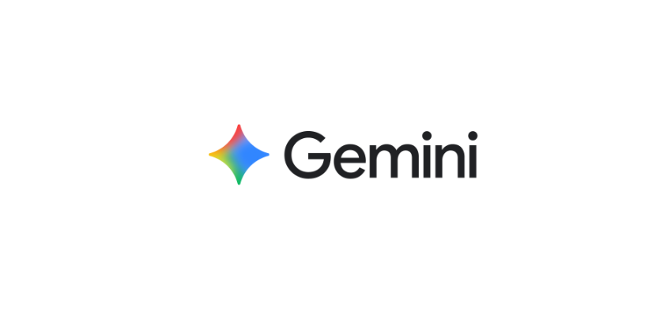

<h1 class="hero-title typing">

🙏 Conclusion

</h1>

A Journey of Learning, Innovation and Growth

---

## 🌟 Internship Summary

My internship at <b>iGrad AI Labs</b> has been an incredible learning experience that enhanced both my technical knowledge and professional skills.

Throughout this internship, I explored Open Source Development, Workflow Automation, Artificial Intelligence, Technical Documentation, Cloud Computing and modern development practices.

Working on practical projects and documentation has helped me transform theoretical knowledge into real-world experience while improving my confidence as an aspiring AI Engineer.

---

## 🚀 What I Achieved

📚

<h3>Knowledge</h3>

Expanded my understanding of AI, Automation, Cloud Computing and Open Source technologies.

⚙️

<h3>Technical Skills</h3>

Strengthened programming, workflow automation and documentation skills.

🤝

<h3>Collaboration</h3>

Experienced collaborative software development using GitHub.

🌟

<h3>Professional Growth</h3>

Developed confidence through practical learning and real-world projects.

---

## 💻 Technologies Mastered

<h3>Git</h3>

<h3>GitHub</h3>

<h3>n8n</h3>

<h3>AWS</h3>

<h3>ChatGPT</h3>

<h3>Gemini</h3>

<h3>Perplexity</h3>

<h3>VS Code</h3>

---

## 📈 My Growth Journey

<h3>🌱 Started as a Learner</h3>

Explored Git, GitHub, Markdown and Open Source fundamentals.

<h3>⚙️ Developed Practical Skills</h3>

Built workflow automation and explored Artificial Intelligence tools.

<h3>📄 Created Professional Documentation</h3>

Designed and developed this internship website using MkDocs Material.

<h3>🚀 Published My Portfolio</h3>

Successfully deployed the complete documentation using GitHub Pages.

---

## ❤️ Acknowledgement

I sincerely thank **iGrad AI Labs** for providing me with this valuable internship opportunity.

I express my heartfelt gratitude to all the mentors, trainers and team members for their continuous support, encouragement and guidance throughout this internship.

Their mentorship helped me strengthen my technical knowledge, improve my practical skills and gain confidence to work on modern software development projects.

---

## 🎯 Future Goals

🤖

  

Artificial Intelligence

⚙️

  

Workflow Automation

☁️

  

Cloud Computing

🌍

  

Open Source

🚀

  

Innovation

---

<h1>

✨ Thank You ✨

</h1>

<b>Hemawarshini Mahendran</b>

Artificial Intelligence & Machine Learning Student

Open Source Contributor

 

<i>

"Learning is a lifelong journey. Every project builds experience, every challenge creates opportunity, and every achievement inspires greater success."

</i>

