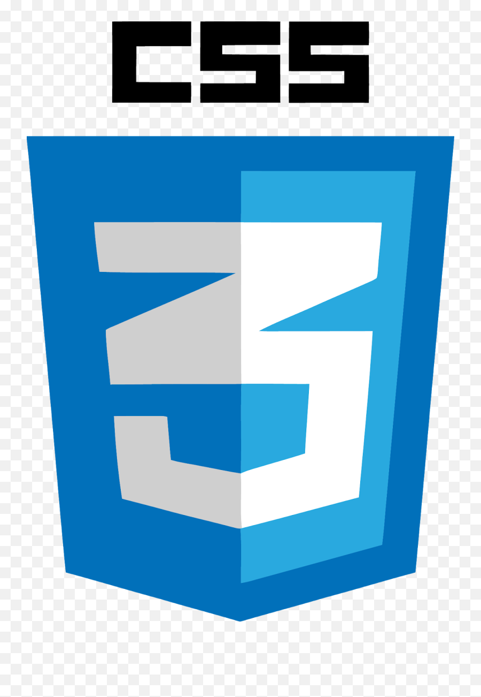
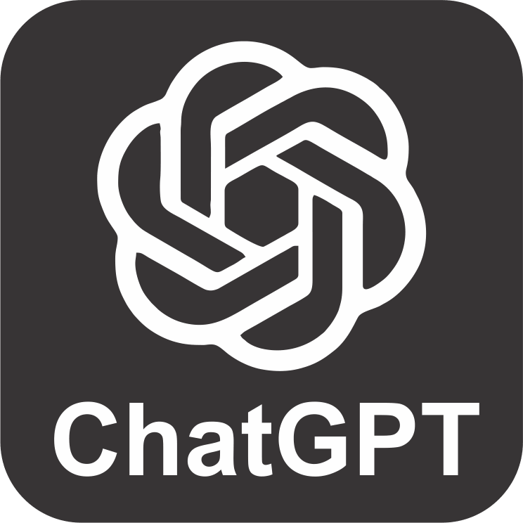

<h1 class="hero-title typing">

🚀 From Learning to Contributing

</h1>

<h2>

My Open Source Internship Journey at iGrad AI Labs

</h2>

 

 

👋 Hello, I'm <b>Hemawarshini Mahendran</b>

🎓 Third Year B.E. Artificial Intelligence & Machine Learning Student

🏢 Open Source Contributor @ iGrad AI Labs

📅 Internship Duration: June 15, 2026 – July 15, 2026

 

<a class="btn" href="about-me/">

👤 About Me

</a>

<a class="btn" href="internship-overview/">

🚀 Internship Overview

</a>

---

<h2>30</h2>

Internship Days

<h2>6</h2>

Courses Completed

<h2>3</h2>

Projects

<h2>12</h2>

Skills Learned

## 🌟 Welcome

Welcome to my internship documentation website.

This website showcases my complete learning journey at **iGrad AI Labs**.

Throughout this internship I explored:

- 🌍 Open Source Development
- ⚙️ Workflow Automation
- 🤖 Artificial Intelligence Tools
- 📖 Technical Documentation
- ☁️ Cloud Technologies
- 🚀 GitHub Collaboration

Each section of this documentation reflects the knowledge, practical experience and technical skills I gained during my internship.

---
## 🏢 Internship Snapshot

🏢

<h3>Organization</h3>

iGrad AI Labs

👩‍💻

<h3>Role</h3>

Open Source Contributor

📅

<h3>Duration</h3>

June 15 – July 15, 2026

🌍

<h3>Domain</h3>

Open Source Development

---

## 🎯 Internship Objectives

📚

  

Learn Git & GitHub

🌍

  

Open Source

⚙️

  

Workflow Automation

📖

  

Documentation

🚀

  

Deployment

---

## 💡 Why This Website?

This portfolio documents my internship experience in a structured and interactive way.

It demonstrates:

✅ My technical learning

✅ Open Source contribution journey

✅ Workflow automation projects

✅ Skills developed during the internship

✅ AI tools used

✅ Documentation and deployment experience

---

## 🌟 Key Highlights

📚

<h3>Learning</h3>

Completed multiple technical learning modules.

⚙️

<h3>Automation</h3>

Built workflow automation using n8n.

🌍

<h3>Open Source</h3>

Explored GitHub collaboration and repositories.

📄

<h3>Documentation</h3>

Created this documentation using MkDocs Material.

---
## 🛠 Technologies & Platforms

<h3>Git</h3>

Version Control

<h3>GitHub</h3>

Open Source

<h3>Python</h3>

Programming

<h3>HTML5</h3>

Frontend

<h3>CSS3</h3>

Styling

<h3>n8n</h3>

Automation

<h3>AWS</h3>

Cloud

<h3>VS Code</h3>

Development

---

## 🤖 AI Tools Used

<h3>ChatGPT</h3>

Learning & Coding

<h3>Gemini</h3>

Research

<h3>Perplexity</h3>

AI Search

---
---

## 🚀 Featured Workflow

📝

  

User Input

⚡

  

Trigger

⚙️

  

Workflow

🤖

  

AI Processing

☁️

  

Cloud Services

📧

  

Final Output

---

## 📈 Internship Progress

Git & GitHub

Markdown

MkDocs Material

Workflow Automation

Artificial Intelligence

HTML & CSS

---

## ⭐ Documentation Includes

👤

<h3>About Me</h3>

🏢

<h3>About iGrad AI Labs</h3>

🎯

<h3>Internship Overview</h3>

📚

<h3>Learning Journey</h3>

🌍

<h3>Open Source</h3>

🤖

<h3>Automation Projects</h3>

🛠

<h3>Skills</h3>

🏆

<h3>Achievements</h3>

🙏

<h3>Conclusion</h3>

---
---

## 🌟 Why This Internship Matters

💡

<h3>Knowledge</h3>

Strengthened my understanding of AI, Automation, Cloud Computing and Open Source Development.

🚀

<h3>Practical Experience</h3>

Worked with industry-standard tools and gained real-world project experience.

🤝

<h3>Collaboration</h3>

Improved teamwork through GitHub collaboration and documentation.

🎯

<h3>Career Growth</h3>

Prepared myself for future software engineering and AI opportunities.

---

## ❤️ My Internship Journey

<h3>📚 Started Learning</h3>

Learned Git, GitHub, Markdown and Open Source fundamentals.

<h3>⚙️ Built Automation</h3>

Created workflow automation using n8n and AI tools.

<h3>📄 Created Documentation</h3>

Developed a professional documentation website using MkDocs Material.

<h3>🚀 Published Website</h3>

Successfully deployed my internship portfolio using GitHub Pages.

---

<h2 align="center">

💜 My Motto

</h2>

<i>

"Every project teaches something new, every challenge builds confidence, and every contribution shapes a better engineer."

</i>

---

<h1 class="hero-title">

✨ Thank You for Visiting ✨

</h1>

<b>Hemawarshini Mahendran</b>

Artificial Intelligence & Machine Learning Student

Open Source Contributor @ iGrad AI Labs

 

<a class="btn" href="about-me/">

👤 About Me

</a>

<a class="btn" href="internship-overview/">

🚀 Explore Internship

</a>

&times;

<h2 id="popup-title"></h2>

